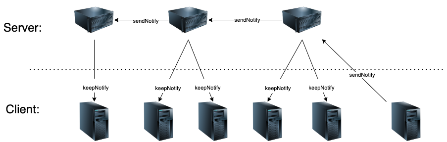

# throughNotify
内网穿透消息通知服务集群

# 消息传递流程
1. 客户端发起消息通知请求到任意一台服务端
2. 服务集群同步消息通知下发
3. 服务集群下发消息请求到已链接到服务端的客户端



# 使用方式
```js
import {Service, Client} from 'throughnotify'
const service1  = new Service({
    partnerList:['0.0.0.0:8081']
})
await service1.start('0.0.0.0:8080')
const service2  = new Service({
    partnerList:['0.0.0.0:8080']
})
await service2.start('0.0.0.0:8081')
const client1 = new Client({address:'0.0.0.0:8081'})
client1.keepNotify()
client1.on('notify',(data)=>{
    console.log(data)
})
const client2 = new Client({address:'0.0.0.0:8080'})
let i = 0;
let timer2 = setInterval(async ()=>{
    await client2.sendNotify({hello:'world'+ i});
    i++;
    if(i>3){
        clearInterval(timer2)
        service1.forceShutdown()
        service2.forceShutdown()
    }
},1000)
```


# 关于
为啥能实现内网穿透，keepNotify是由客户端发起的长链接，也就是说只要服务端暴露在客户端都可以访问的网段，即可实现不同网段的客户端进行数据交换通知
